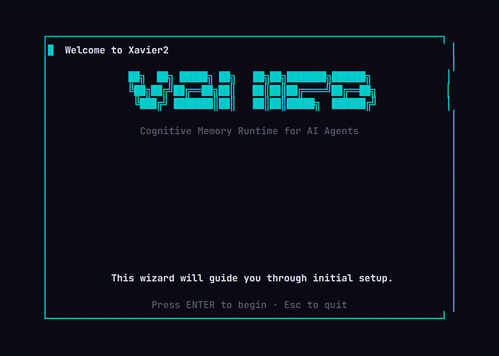
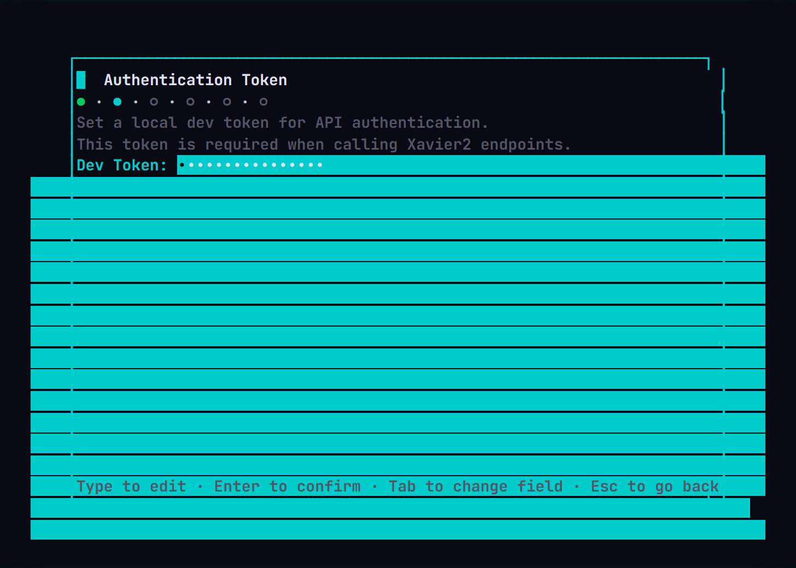
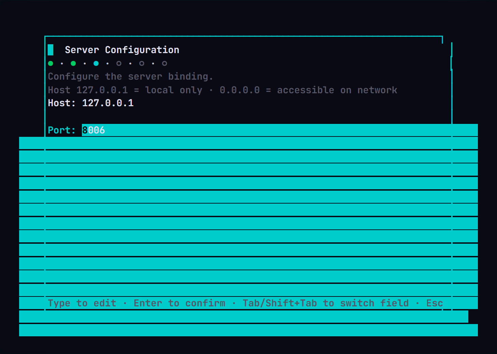
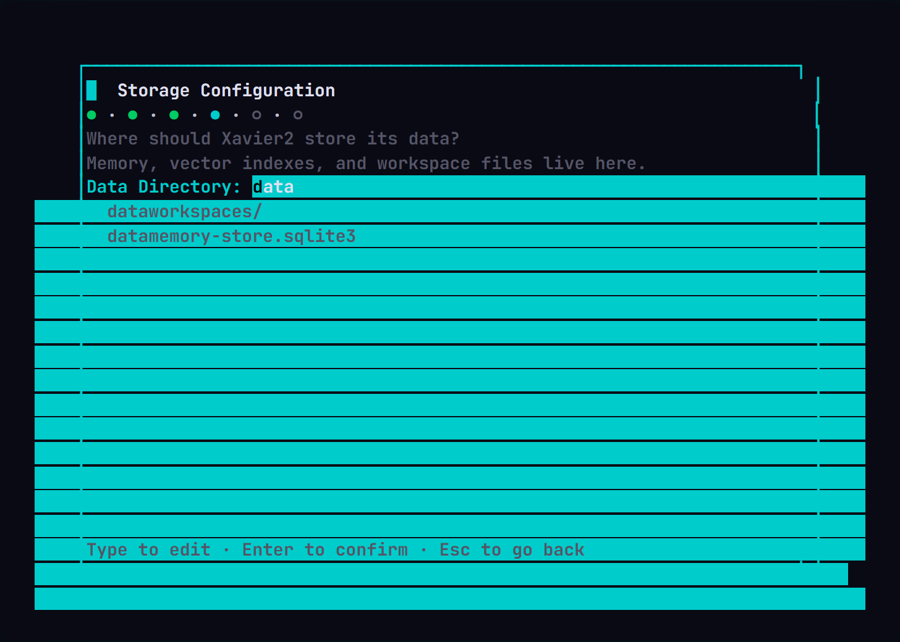
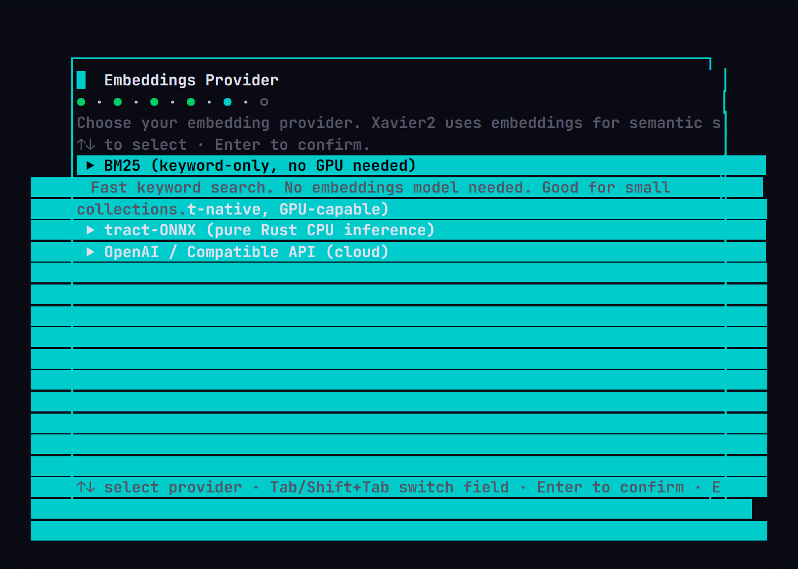
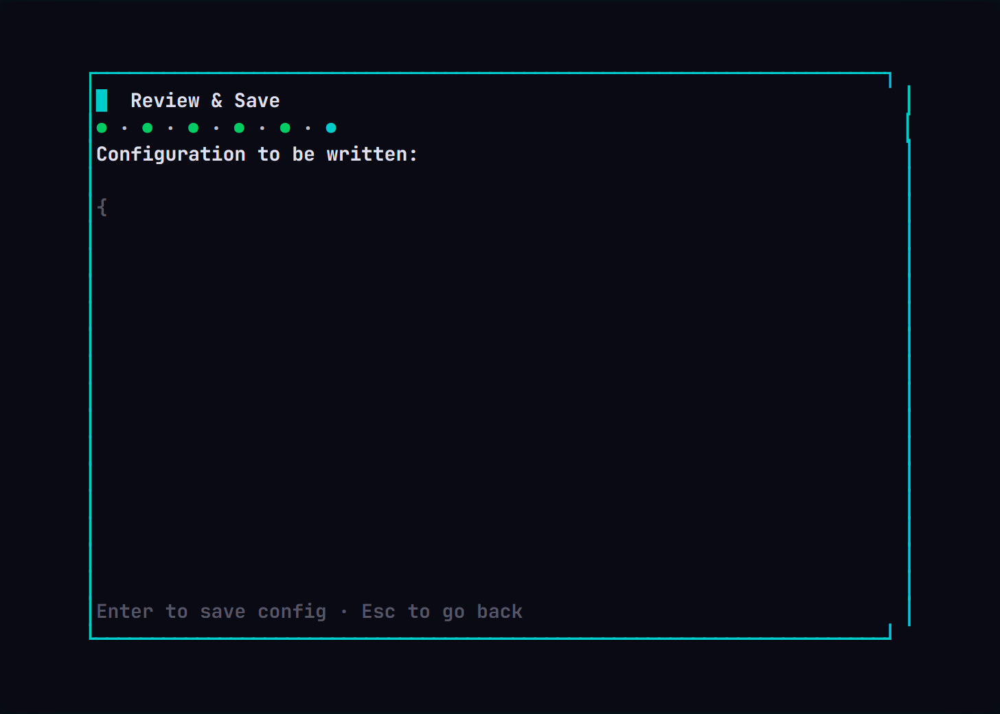

# Xavier — Fast Vector Memory for AI Agents

[](https://opensource.org/licenses/MIT)
[](https://github.com/iberi22/xavier)
[](https://www.rust-lang.org/)
[](https://github.com/iberi22/xavier/actions)

Xavier is a **Rust-based memory runtime for AI agents** with HTTP, CLI, and MCP entry points. It stores, retrieves, and manages vector embeddings and structured memory over a SQLite-backed store, giving agents fast contextual recall without external dependencies.

## Quick Start

```bash
# Option 1: Install from source
cargo install xavier

# Option 2: Run with Docker
docker run -p 8006:8006 -v xavier-data:/data ghcr.io/iberi22/xavier:latest

# Start the server with a token
export XAVIER_TOKEN=your-secret-token
xavier http

# Add and search memory
xavier add "AI agents should always verify their sources" "agent-guidelines"
xavier search "agent guidelines"

# Build a daily chronicle from local project activity
xavier chronicle harvest --since 2026-05-01
xavier chronicle generate
xavier chronicle preview
```

## Installer

Xavier2 ships with an interactive **TUI setup wizard** that configures everything in 6 steps — no manual config editing needed.

### One-liner install

**Windows (PowerShell):**
```powershell
irm https://raw.githubusercontent.com/iberi22/xavier/main/install.ps1 | iex
```

**Linux/macOS:**
```bash
curl -fsSL https://raw.githubusercontent.com/iberi22/xavier/main/install.sh | bash
```

The wizard walks you through authentication token, server bind, storage path, and embedding provider selection.

### Setup Wizard Screenshots

<p align="center">
  
  
  
</p>

<p align="center">
  
  
  
</p>

### Manual install

```bash
# From source
cargo install xavier

# Run the setup wizard
xavier-installer

# Or skip wizard and configure manually
cp config/xavier.config.example.json config/xavier.config.json
```

## Features

- **HTTP API** — JSON REST endpoints for memory CRUD with token-based auth
- **CLI client** — `add`, `search`, `stats` commands for quick interaction
- **MCP server** — stdio-based [Model Context Protocol](https://modelcontextprotocol.io) server exposing `search`, `add`, and `stats` tools
- **SQLite-backed** — Persistent, zero-infrastructure storage with vector search support
- **Public dataset export** — Generate read-optimized NDJSON datasets for agent bootstrap (see [Public Export](#public-dataset-export))
- **Hybrid retrieval** — Building blocks for combining keyword and semantic search
- **TUI installer** — Interactive terminal wizard (6 steps) for painless setup on Windows, Linux, and macOS
- **Agent runtime modules** — Ready-to-use runtime components for agent memory workflows
- **Chronicle workflow** — `xavier chronicle` can harvest project activity, generate daily technical posts, preview them, and publish Markdown outputs
- **Plugin system** — Extensible enterprise integrations (Cortex, PgHeart)

## Enterprise Plugins

Xavier supports enterprise integrations via the plugin system:

### Cortex Enterprise
Bidirectional sync with Cortex Enterprise Cloud.

```bash
# Configure via environment
export CORTEX_ENTERPRISE_URL=https://cortex.example.com
export CORTEX_TOKEN=your-token

# Sync manually
xavier plugin sync cortex push
```

### PgHeart
PostgreSQL monitoring and heartbeat.

```bash
# Configure via environment
export PGHEART_URL=https://pgheart.example.com
export PGHEART_TOKEN=your-token
export PGHEART_INSTANCE_ID=instance-123

# Sync manually
xavier plugin sync pgheart push
```

### Automated Sync
Cron jobs run every 15 minutes for automatic sync. Configure secrets in GitHub Actions:
- `CORTEX_ENTERPRISE_URL` / `CORTEX_TOKEN`
- `PGHEART_URL` / `PGHEART_TOKEN` / `PGHEART_INSTANCE_ID`

```
┌─────────────┐  ┌──────────┐  ┌──────────┐
│   CLI       │  │  HTTP    │  │   MCP    │
│  (add/search)│  │  Server  │  │  (stdio) │
└──────┬──────┘  └────┬─────┘  └────┬─────┘
       │              │              │
       └──────────────┼──────────────┘
                      │
              ┌───────▼────────┐
              │  Core Engine   │
              │  (add, search, │
              │   stats,       │
              │   export)      │
              └───────┬────────┘
                      │
              ┌───────▼────────┐
              │  SQLite Store  │
              │  + Vector      │
              │  Embeddings    │
              └────────────────┘
```

The three entry points (CLI, HTTP, MCP) share the same core engine, which handles memory operations over a SQLite-backed store. Each entry point is independent — you can run the HTTP server, use the CLI against it, or connect the MCP server to any MCP-compatible host.

## Public Dataset Export

Generate a public, read-optimized dataset for agent context without cloning or rebuilding:

```bash
xavier export --public
```

Output lives in `xavier-dataset/` at the repository root with NDJSON files for memories, entities, timeline events, git commits, code symbols, and more.

Example agent bootstrap from GitHub raw:

```bash
BASE="https://raw.githubusercontent.com/iberi22/xavier/main/xavier-dataset"

curl -fsSL "$BASE/dataset_manifest.json"
curl -fsSL "$BASE/memories.ndjson" | head -n 20
curl -fsSL "$BASE/code_symbols.ndjson" | jq -c 'select(.kind == "function")' | head
```

Full export schema is documented at [docs/FEATURE_STATUS.md](docs/FEATURE_STATUS.md).

## HTTP API

```bash
curl http://localhost:8006/health

curl -X POST http://localhost:8006/memory/add \
  -H "X-Xavier-Token: $XAVIER_TOKEN" \
  -H "Content-Type: application/json" \
  -d '{"content":"Design decision: use RRF","path":"decisions/001"}'

curl -X POST http://localhost:8006/memory/search \
  -H "X-Xavier-Token: $XAVIER_TOKEN" \
  -H "Content-Type: application/json" \
  -d '{"query":"design decision","limit":5}'
```

Full API reference: [docs/site/src/content/docs/reference/api.md](docs/site/src/content/docs/reference/api.md).

## MCP

Start the MCP stdio server:

```bash
xavier mcp
```

Current MCP tools: `search`, `add`, `stats`.

## Public Data & Export

Xavier will expose a public export pipeline through:

```bash
xavier export --public \
  --huggingface-repo iberi22/xavier-dataset \
  --huggingface-token $HUGGINGFACE_TOKEN
```

The export protocol splits lightweight public context from heavy analytical artifacts:

1. Generate NDJSON manifests and JSON schemas, then commit them to GitHub in `iberi22/xavier-dataset`.
2. Generate Parquet files for embeddings and metrics, a complete `.sqlite3` snapshot, and vector indexes such as `.lance/` or `.faiss`.
3. Upload the heavy artifacts to the Hugging Face dataset `iberi22/xavier-dataset`.
4. Include Hugging Face artifact URLs inside the NDJSON records committed to GitHub.

Use GitHub raw URLs for lightweight agent context and Hugging Face for larger downloads.

| Layer | Location | Contents | Typical size |
|---|---|---|---|
| Manifest + context | GitHub raw | NDJSONs, schemas | ~1-10 MB |
| Analytical data | Hugging Face | Parquet files for embeddings and metrics | ~50-500 MB |
| Database + vectors | Hugging Face | `.sqlite3`, `.lance/`, `.faiss` | ~100 MB-2 GB |

See the full public export reference in [docs/site/src/content/docs/reference/export.md](docs/site/src/content/docs/reference/export.md).

## Configuration

Runtime configuration lives in [config/xavier.config.json](config/xavier.config.json). Secrets go in `.env` (see [.env.example](.env.example)).

| Variable | Default | Description |
|---|---|---|
| `XAVIER_TOKEN` | auto-generated | Authentication token for HTTP API |
| `XAVIER_DEV_MODE` | `false` | Skip auth in development scenarios |
| `XAVIER_CONFIG_PATH` | `config/xavier.config.json` | Override runtime config file |
| Provider keys | unset | External API credentials (e.g. embedding providers) |

## Documentation

- [Installer &amp; Setup](docs/screenshots/) — TUI wizard screenshots and install guide
- [Feature Status](docs/FEATURE_STATUS.md) — Current verified surface and 1.0 gaps
- [CLI Reference](docs/guides/CLI_REFERENCE.md) — Full command documentation
- [API Reference](docs/site/src/content/docs/reference/api.md) — HTTP endpoint details
- [Architecture](docs/ARCHITECTURE.md) — System design and hexagonal architecture
- [Public Release Roadmap](docs/PUBLIC_RELEASE_ROADMAP.md) — Upcoming milestones

## Status

Current release: **0.6 beta usable**. Not yet 1.0 — see [FEATURE_STATUS.md](docs/FEATURE_STATUS.md) for verified features and remaining gaps.

## License

MIT — see [LICENSE](LICENSE) for details.
