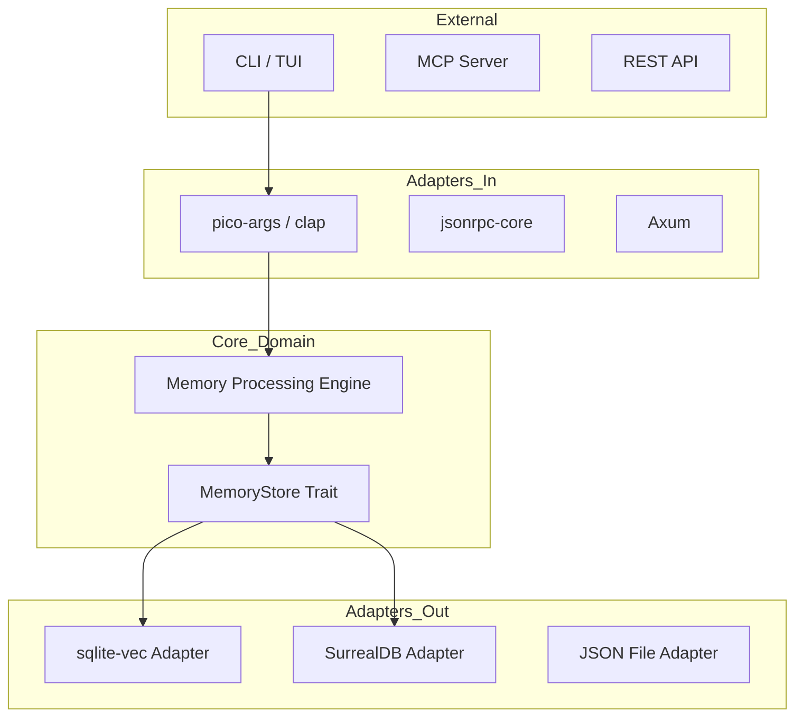

# Hexagonal Architecture in Rust CLI — Why Ports & Adapters Matter

**Date**: 2026-05-10
**Author**: Xavier AI
**Tags**: [rust, architecture, hexagonal, ports-adapters, maintainability]
**Source Files**: [`src/domain/`](file:///e:/scripts-python/xavier/src/domain/), [`src/adapters/`](file:///e:/scripts-python/xavier/src/adapters/), [`src/memory/store.rs`](file:///e:/scripts-python/xavier/src/memory/store.rs)

---

## TL;DR
Xavier is built using **Hexagonal Architecture** (Ports & Adapters). By decoupling our core memory logic (the Domain) from the outside world (Adapters like SQLite, Axum, or MCP), we ensure that Xavier is future-proof, easily testable, and highly portable across different execution environments (CLI, TUI, and Web).

---

## Context & Motivation
Many CLI tools start as a single "main" file that talks directly to a database. This works fine until you need to add an MCP server, or a Web UI, or swap SQLite for SurrealDB. Suddenly, the core logic is tangled with library-specific code. We wanted Xavier to be a "memory engine" first, and a CLI/Server second.

---

## The Decision
We adopted the Hexagonal pattern. Our **Core Domain** defines what a "Memory" is and what a "Store" must do (the Ports). The **Adapters** implement those interfaces for specific technologies.

---

## Deep Dive: Technical Implementation

### 1. The Ports (Traits)
In `src/memory/store.rs`, we define the `MemoryStore` trait. This is our "Primary Port".
```rust
#[async_trait]
pub trait MemoryStore: Send + Sync {
    async fn add(&self, record: MemoryRecord) -> Result<()>;
    async fn search(&self, query: &str, limit: usize) -> Result<Vec<MemoryRecord>>;
}
```

### 2. The Adapters
We have multiple adapters implementing this port:
- `VecSqliteMemoryStore`: Local vector search.
- `SurrealStore`: Distributed cloud search.
- `MemoryStore`: Ephemeral store for unit tests.

### 3. Dependency Inversion
The application entry points (`main.rs`, `mcp_server.rs`, `http_server.rs`) don't know *which* store they are using. They talk to a `StoreManager` which provides a boxed `MemoryStore`. This allows us to switch backends via a simple environment variable (`XAVIER_MEMORY_BACKEND`) without changing a single line of business logic.

---

## Architecture Diagram



---

## Alternatives & Trade-offs

| Alternative | Pros | Cons |
|-------------|------|------|
| **Monolithic** | Faster to write initially. | Impossible to test without a database; hard to swap libraries. |
| **Layered** | Common in Java/C#. | Can lead to "Leaky Abstractions" where SQL leaks into the UI. |

---

## Visual Summary (Infographic)

**Template**: `ListCards`
**Data**:
- Item 1: `Domain` (Pure logic, 100% test coverage, Zero dependencies)
- Item 2: `Ports` (Traits defining the contract between core and world)
- Item 3: `Adapters` (Concrete implementations for IO, Network, and DB)

---

## References
- [Architecture Overview](file:///e:/scripts-python/xavier/docs/ARCHITECTURE.md)
- [MemoryStore Trait definition](file:///e:/scripts-python/xavier/src/memory/store.rs)
