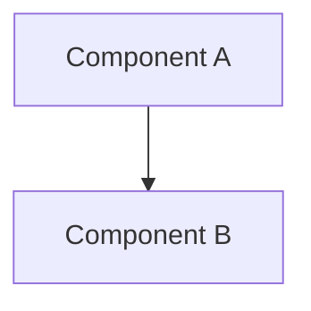

# [Title] — [Subtitle]

**Date**: YYYY-MM-DD
**Author**: Xavier AI
**Tags**: [tag1, tag2]
**Source Files**: [`path/to/file.rs`](file:///path/to/file.rs)

---

## TL;DR
[Executive summary of the technical decision and its impact.]

---

## Context & Motivation
[Describe the problem we were trying to solve. What was the limitation of the previous approach or the standard industry solution?]

---

## The Decision
[State the technical choice clearly. Why this specific library, architecture, or pattern?]

---

## Deep Dive: Technical Implementation
[Explain the implementation details. Use code blocks for key structures or functions.]

```rust
// Example code explanation
pub struct TechnicalDetail {
    pub field: Type,
}
```

[Explain lifetimes, concurrency models, or data structures used.]

---

## Architecture Diagram
[Mermaid diagram]



---

## Alternatives & Trade-offs
[Comparison table or list of alternatives considered.]

| Alternative | Pros | Cons |
|-------------|------|------|
| [Alt 1] | [Pro] | [Con] |

---

## Visual Summary (Infographic)
[Describe which template from INFOGRAPHIC_SYSTEM.md is being used and provide the data.]

**Template**: `Comparison`
**Data**:
- Left: [Current Choice]
- Right: [Alternative]
- VS: [Key Metric]

---

## References
- [Source File](file:///path/to/file.rs)
- [Related ADR](file:///docs/ADR/...)
- [External Spec](https://...)
